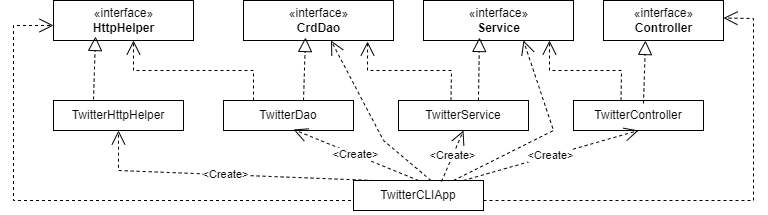

# Introduction

This Java application does CR~~U~~D
operation of tweet object (Update operation is not 
performed since Tweet can't be updated) on Twitter
via Twitter REST API. The user is allowed to 
post/show/delete Tweets on Twitter Developer Account. 
The output of each operation was formed in JSON format.
The application used MVC(minus V) architecture, which 
contains a Model, data access object(DAO) layer, 
service layer, and controller layer. The application was
tested using JUnit, and Mockito. In the end, Maven was used
for creating a JAR file to package the project, and finally,
Docker was used to dockerize and uploaded a docker image 
to the DockerHub to facilitate users to use the program.


# Quick Start

First, to package the app using Maven, use ```mvn clean
package```. Also, build the docker image to run the program 
```docker build -t ${dockeruser}/twitter .```.

Set up and Export these environment variables to connect 
to Twitter API.

```
consumerKey: API key
consumerSecret: API secret
accessToken: Access token
tokenSecret: Access secret
```
<br/>

First, before executing CRUD operation, pull the docker 
image from DockerHub
<br/>
```docker pull m3996m/twitter```

### Post
To post a tweet, execute this command in Command Line:
```
docker run --rm \
-e consumerKey=YOUR_VALUE \
-e consumerSecret=YOUR_VALUE \
-e accessToken=YOUR_VALUE \
-e tokenSecret=YOUR_VALUE \
m3996m/twitter "post" "tweet_text" "latitude:longitude"
```


### Show
To show a tweet, execute this command in Command Line:
```
docker run --rm \
-e consumerKey=YOUR_VALUE \
-e consumerSecret=YOUR_VALUE \
-e accessToken=YOUR_VALUE \
-e tokenSecret=YOUR_VALUE \
m3996m/twitter "show" tweet_id [field1,field2,...]
```


### Delete
To delete a tweet, execute this command in Command Line:
```
docker run --rm \
-e consumerKey=YOUR_VALUE \
-e consumerSecret=YOUR_VALUE \
-e accessToken=YOUR_VALUE \
-e tokenSecret=YOUR_VALUE \
m3996m/twitter "delete" [id1,id2,...]
```


# Design

## UML diagram


### App/main


#### TwitterCLIApp
- This class declares and instantiates all the components
which are ```TwitterHttpHelper```, ```TwitterDao```,
  ```TwitterService```, and ```TwitterController```.
This class also calls the run method which calls 
controller methods and print tweets.

<br>

### Controller


#### TwitterController
- In this class, it checks whether the correct amount of 
user inputs are typed in and it calls the service layer method.
This class does not handle business logic.


<br>

### Service


#### TwitterService
- This class handles business logic. For example, this class
makes sure that the text of the tweet is within 140 characters
and whether the ID is in a valid format.


<br>

### DAO


#### TwitterDao
- This class handles the HTTP requests and responses 
which will be used in REST API request. This class creates
URI for post/show/delete request and it's sent to
HttpHelper


## Models
A simplified version of the tweet object was used
for the project.
```
{
   "created_at":"Mon Feb 18 21:24:39 +0000 2019",
   "id":1097607853932564480,
   "id_str":"1097607853932564480",
   "text":"test with loc223",
   "entities":{
      "hashtags":[],      
      "user_mentions":[]  
   },
   "coordinates":null,    
   "retweet_count":0,
   "favorite_count":0,
   "favorited":false,
   "retweeted":false
}
```

5 different Classes were used to construct tweet object model
- Tweet
- Entities
- Hashtag
- UserMention
- Coordinates

## Spring
- SpringBoot was used for managing dependencies in this 
project. The components annotated with ```@Component```,
  ```@Repository```, ```@Controller```, ```@Service```
notified Spring that these are Bean which has to be
managed by IoC Container. Dependencies are defined in
each component and dependency was injected using the
constructor. The above constructor, ```@Autowired``` 
annotation was used to let the IoC container know to 
inject dependency through the marked constructor. 
In the end, ```@ComponentScan``` was used to scan the beans.

# Test
- The application was tested using JUnit and Mockito.
```TwitterController```, ```TwitterDao```, and
```TwitterService``` was tested. JUnit was used for integration 
test to see if each class is working as expected and 
Mockito was used for unit testing to see if individual 
units of the class is working as expected.

## Deployment
- I used Maven and Docker to package, dockerize and 
deploy the application. Maven was used to package the
application as a jar file. Docker was used to building a
docker image and it was pushed to DockerHub.

# Improvements
- Add a feature that user can read multiple tweets at once.
- Build real Graphical User Interface to allow users to 
interact with application.
- Add a feature that user can get most liked tweet of the user.