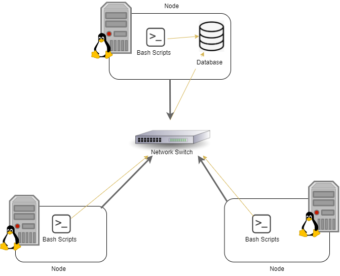

# Linux Cluster Monitoring Agent


# Introduction
This project runs monitoring agent for a Linux cluster of nodes. 
The hardware specifications and resource usage of each user, which is 
each node is recorded in real-time.

The collected hardware specification data and 
resource usage is recorded in a psql instance. Hardware 
specification is inserted only once at installation 
time but resource usage statistics is inserted into 
the database every minute.

I have used bash script, docker and git to implement this project.
Docker was used to set up a psql instance which
enabled me to use it on my local machine.
Git was used to manage and keep track of my source code for 
each task.


# Quick Start
1. Start a psql instance using psql_docker.sh
```
./scripts/psql_docker.sh create [db_username][db_password]
```
```
./scripts/psql_docker.sh start
```
<br />

2. Create Database using psql CLI and quit psql CLI
```
psql -h psql_host -U psql_user -W


postgres=# CREATE DATABASE db_name;


postgres=# \q
```
<br />

3. Create tables using ddl.sql
```
psql -h psql_host -U psql_user -d db_name -f sql/ddl.sql
```
<br />

4. Insert hardware specs data into the DB using host_info.sh
```
./scripts/host_info.sh psql_host psql_port db_name psql_user psql_password
```
<br />


5. Insert Hardware usage data into the DB using host_usage.sh
```
./scripts/host_usage.sh psql_host psql_port db_name psql_user psql_password
```
<br />

6. Crontab setup
```
crontab -e

#add this code to crontab
* * * * * bash /home/centos/dev/jrvs/bootcamp/linux_sql/host_agent/scripts/host_usage.sh 
psql_host psql_port db_name psql_user psql_password > /tmp/host_usage.log
```
- Instead using the path specified in code, 
use your own path from your output of `pwd` for `host_usage.sh`.

<br />

# Implementation

---

## Architecture


<br />

## Scripts

- `psql_docker.sh`
    - This script creates docker container and set up 
      the psql instance using docker.
    - This script is also used to start and stop docker container
```
./scripts/psql_docker.sh create|start|stop [db_username][db_password]
```

<br />

- `ddl.sql`
  - This file contains two CREATE TABLE statements
    which creates table for hardware specification
    `host_info` and server usage data `host_usage`
```
psql -h psql_host -U psql_user -d db_name -f sql/ddl.sql
```

<br />


- `host_info.sh`
    - This script inserts hardware specification data 
      into psql instance only once at installation 
      time.
```
./scripts/host_info.sh psql_host psql_port db_name psql_user psql_password
```

<br />

- `host_usage.sh`
    - This script inserts server usage data and 
      into the psql instance.
    - Unlike `host_info.sh`, this script is 
      executed every minute to insert current
      server usage data into psql instance.
```
./scripts/host_usage.sh psql_host psql_port db_name psql_user psql_password
```

<br />

- `crontab`
  - This file is used to run `host_usage.sh` script
    every minute which inserts server usage data to
    psql instance.
```
crontab -e

* * * * * bash /home/centos/dev/jrvs/bootcamp/linux_sql/host_agent/scripts/host_usage.sh 
psql_host psql_port db_name psql_user psql_password > /tmp/host_usage.log
```
<br />
<br />

## Database Modeling

#### host_info

| Column           | Type      | Constraints | 
|------------------|-----------|-------------|
| id               | SERIAL    | PRIMARY KEY |
| hostname         | VARCHAR   | NOT NULL    |
| cpu_number       | INT       | NOT NULL    |
| cpu_architecture | VARCHAR   | NOT NULL    |
| cpu_model        | VARCHAR   | NOT NULL    |
| cpu_mhz          | FLOAT     | NOT NULL    | 
| L2_cache         | INT       | NOT NULL    |
| total_mem        | INT       | NOT NULL    | 
| timestamp        | TIMESTAMP | NOT NULL    |


<br />

#### host_usage
| Column         | Type      | Constraints                         | 
|----------------|-----------|-------------------------------------|
| timestamp      | TIMESTAMP | NOT NULL                            |
| host_id        | INT       | NOT NULL, FOREIGN KEY(host_info.id) |
| memory_free    | INT       | NOT NULL                            |
| cpu_idle       | INT       | NOT NULL                            |
| cpu_kernel     | INT       | NOT NULL                            |
| disk_io        | INT       | NOT NULL                            | 
| disk_available | INT       | NOT NULL                            |

<br />

# Test


- I tested bash scripts and sql file individually
  by running script usage on terminal and correct
  results and data was observed in psql instance with 
  sql queries.

<br />

# Deployment


- This project used Docker to provision psql instance
  and crontab was used to execute `host_usage.sh`
  periodically. During the project, source code was 
  managed by git and pushed into Github. 

<br />

# Improvements


- Create hardware specification update 
  option in case hardware component changes
- Create more columns in table for other 
  hardware specifications to database
- I still have to run several scripts to set
  up database but later, all the scripts should
  be included into single script, therefore
  every task can be completed at once.


